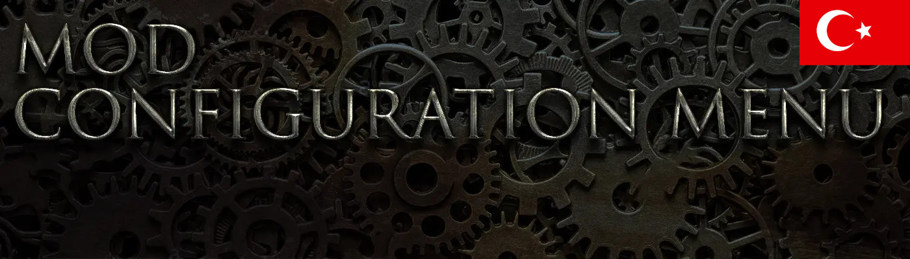
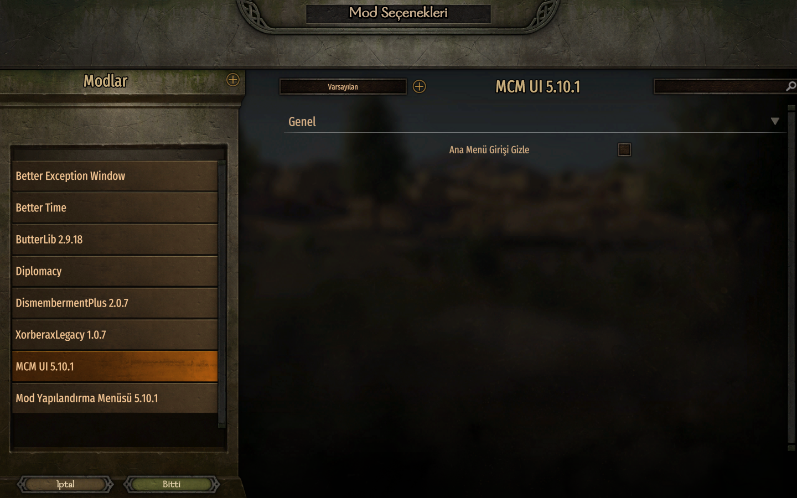
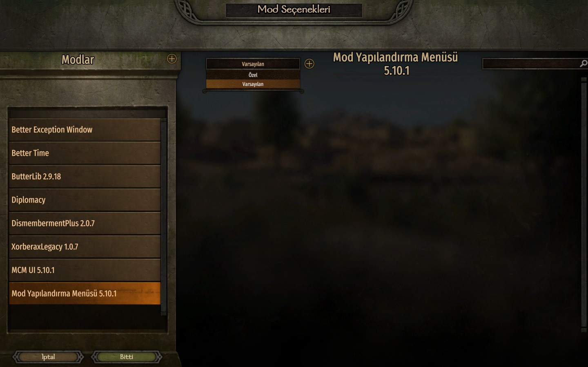

# Bannerlord MCM menu turkish translation

Bu mod, [Mount & Blade II: Bannerlord](https://www.taleworlds.com/tr/Games/Bannerlord) için geliştirilen [Mod Configuration Menu (MCM)](https://www.nexusmods.com/mountandblade2bannerlord/mods/612) modunun Türkçe dil desteğini sağlar. MCM, Bannerlord'daki modların yapılandırılmasını kolaylaştıran temel bir moddur ve mod ayarlarını oyun içinden rahatça yönetmenize olanak tanır.

Bu çeviri modu, MCM'nin tüm menü, uyarı ve ayarlarını eksiksiz bir şekilde Türkçeye çevirir, böylece Türk oyuncuların oyunu daha anlaşılır ve keyifli bir şekilde deneyimlemesine yardımcı olur. 

## Ekran görüntüleri

## Gereksinimler
[Mount & Blade II: Bannerlord](https://www.taleworlds.com/tr/Games/Bannerlord) >= 1.2.x sürümü

[Mod Configuration Menu](https://www.nexusmods.com/mountandblade2bannerlord/mods/612)

## Kurulum
İlk öncelikle ana modumuz olan [Mod Configuration Menu](https://www.nexusmods.com/mountandblade2bannerlord/mods/612) modunu kurduğunuzdan emin olun.

Ardından çeviri dosyalarını indirin ve **Modules** klasörünü Mount & Blade II: Bannerlord oyun klasörüne atın.

